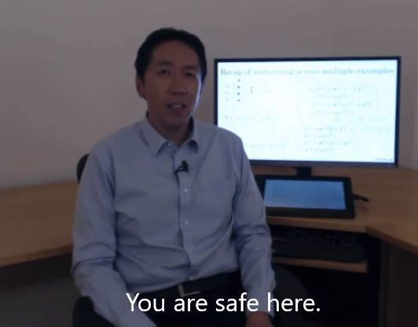
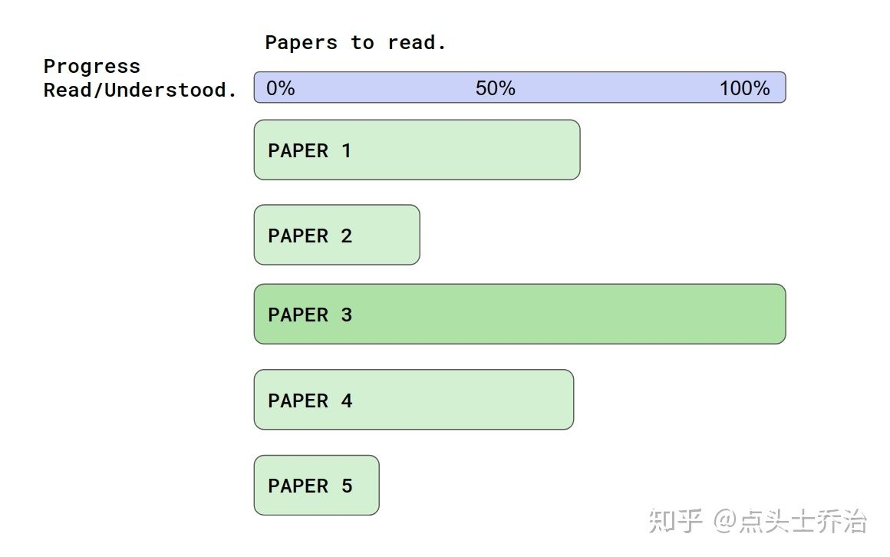

# 文献阅读 · 吴恩达建议

## 如何通过阅读研究论文来高效和相对快速地学习？

1. **编写一份论文列表：**尝试创建一份研究论文列表、包括你拥有的任何文本或学习资源。
2. **过一遍列表**：基本上，你应该以一种并行的方式阅读研究论文，意思是一次处理多篇论文。具体地说，试着快速浏览并理解每一篇文章，而不是全部读完，也许你读了每一篇文章的10-20%，也许这足以让你对手头的文章有一个高水平的理解。在那之后，你可能会决定删除其中的一些论文，或者只是浏览一两篇论文，把它们通读一遍。

## 论文搜集和编录，并行阅读

在搜集完一批论文之后，**首先应该有一个记录所找的文章和阅读进度的工具，做好编录工作**。这是一项不可或缺的准备工作。通常情况下针对一个问题我们会找到十几篇甚至几十篇来阅读，花些时间做好准备工作，可以让后期阅读更有效率。

文献不是一篇接着一篇读的，而是一个**多篇并行**的过程。举例来说，可以先从一堆文献中挑出五篇，快速浏览一遍。在知道了大意之后可以对文章进行取舍。有一些文章观点具有开创性、引用数量高，可以再多花时间进行精读。言之无物的文章就可以舍弃，同时加入新的文章来补充这个『在读文章列表』。读者可以在这几篇文章中来回跳跃，因为它们之间经常会有互相启发的内容，这种并行阅读的方式可以提高效率，加深理解。

添加图片注释，不超过 140 字（可选）

他还提到，如果你读到：

- **5-20篇论文**(在选择的领域，比如语音识别)=>这可能是足够的知识，你可以实现一个语音识别系统，但可能不够研究或让你处于前沿。
- **50-100篇论文**=>你可能会对这个领域的应用(语音识别)有很好的理解。

## **如何读论文？**

不要从头读到尾。相反，**需要多次遍历论文**，下面是具体如何做的：

1. **阅读文章标题、摘要和图：**通过阅读文章标题、摘要、关键网络架构图，或许还有实验部分，你将能够对论文的概念有一个大致的了解。在深度学习中，有很多研究论文都是将整篇论文总结成一两个图形，而不需要费力地通读全文。
2. **读介绍+结论+图+略过其他**：介绍、结论和摘要是作者试图仔细总结自己工作的地方，以便向审稿人阐明为什么他们的论文应该被接受发表。 此外，略过相关的工作部分(如果可能的话)，这部分的目的是突出其他人所做的工作，这些工作在某种程度上与作者的工作有关。因此，阅读它可能是有用的，但如果你不熟悉这个主题，有时很难理解。
3. **通读全文，但跳过数学部分**。
4. **通读全文，但略过没有意义的部分：**出色的研究意味着我们发表的东西是在我们的知识和理解的边界上。 他还解释说，当你阅读论文时(即使是最有影响力的论文)，你可能也会发现有些部分没什么用，或者没什么意义。因此，如果你读了一篇论文，其中一些内容没有意义(这并不罕见)，那么你可以先略读。除非你想要掌握它，那就花更多的时间。

当你阅读一篇论文时，试着回答以下问题：

1. **作者试图完成什么**
2. **这个方法的关键要素是什么**
3. **你自己能做什么**
4. **你还想要什么其他的参考资料**

如果你能回答这些问题，就很有希望的能反映出你对论文有很好的理解。

事实证明，当你读更多的论文时，通过练习你会变得更快。因为，很多作者在写论文时使用的是通用格式。

## **理解一篇论文需要花多少时间？**

对于刚接触机器学习的人来说，理解一篇相对简单的论文可能需要一个小时，这并不罕见。但是，有时你可能会偶然发现需要3个小时甚至更长时间才能真正理解的论文。

## **论文的来源**

网上有很多很棒的资源。例如，如果你是新手，列出语音识别领域中最重要的论文的博客文章将非常有用。

随着深度学习的快速发展，很多人都试图跟上它的最新进展。所以，你应该这样做：

1. **Twitter**：令人惊讶的是，Twitter正成为研究人员发现新事物的重要场所。
2. **ML subreddit**：https://www.reddit.com/r/MachineLearning/。
3. 重要的机器学习会议：NIPS/ICML/ICLR。
4. 朋友：找一个对该领域感兴趣的社区或一群朋友，分享有趣的研究论文。

## **更加深入的理解文中的数学部分**

试着从头开始重新推导。虽然，这需要一些时间，但这是一个很好的练习。

## **代码练习**

1. 下载开源代码(如果你能找到的话)并运行它。
2. 从头开始重新实现：如果你能够做到这一点，那么这是一个强烈的信号，表明你已经真正理解了手头的算法。

## **持续进步**

最重要的是不断学习，变得更好是指更加稳定的学习，而不是集中一段时间内读大量的论文。与其在短时间内死记硬背，不如从明年开始每周读两篇论文。

参考资料

- [@吴恩达](https://www.zhihu.com/people/db21ba02a1225c168b660d95bb988cb1)老师在斯坦福大学CS230深度学习课程上的演讲：**对职业发展的一些建议以及阅读研究论文的方法** [原始视频地址Youtube](https://www.youtube.com/watch?v=733m6qBH-jI&list=PLoROMvodv4rOABXSygHTsbvUz4G_YQhOb&index=9&t=0s) / [转载视频地址 bilibili](https://www.bilibili.com/video/BV18E411h7sG) 
- [演讲英文解读：Advice on building a machine learning career and reading research papers by Prof. Andrew Ng](https://medium.com/@mohamedalihabib7/advice-on-building-a-machine-learning-career-and-reading-research-papers-by-prof-andrew-ng-f90ac99a0182) 
- 演讲中文解读1 [@点头士乔治](https://www.zhihu.com/people/1c7e822b4940f9e5d17472e2af7d2846) [科研大牛们怎么读文献](https://www.zhihu.com/question/21278186/answer/1269255636)
- 演讲中文解读2 [@AI算法与图像处理](https://www.zhihu.com/people/c0f174b0da683d8381e1b9c234393b4f) [Andrew Ng关于机器学习职业生涯以及阅读论文的一些建议](https://zhuanlan.zhihu.com/p/79451066)